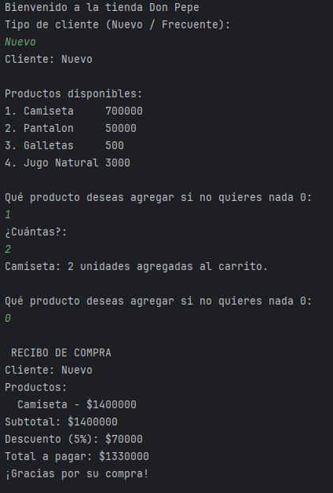
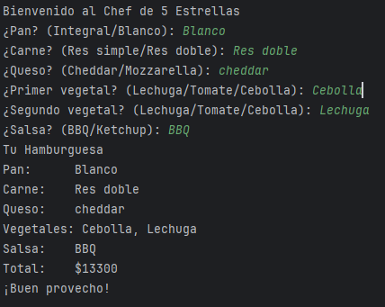
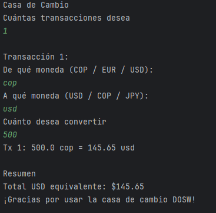
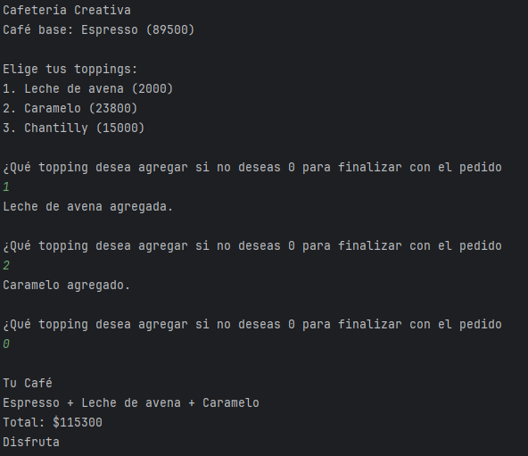

# Laboratorio 2 — Hackathon Express
## SOLID · Patrones de Diseño · UML

**Integrantes:** Sebastián Beltrán · Julián Tinjacá  
**Asignatura:** Desarrollo Orientado a Software  
**Rama:** feature/BeltranSebastian_TinjacaJulian_2026-INT

---

## Estructura del proyecto

```
src/main/java/edu/dosw/bootcamp/lab/
├── solid/
│   └── reto1TiendaDonPepe/
├── creacionales/
│   ├── reto2ChefEstrellas/
│   └── reto3ReinoVehiculos/
├── comportamiento/
│   ├── reto4CasaDeCambio/
│   ├── reto6SoporteTecnico/
│   └── reto7ControlRemoto/
└── estructurales/
    ├── reto5CafePersonalizado/
    └── reto8Zoologico/
```

---

# Reto 1 — La Tienda de Don Pepe

## Descripción

Sistema de ventas que permite a un cliente 
agregar productos a un carrito, recibir un descuento según su tipo
y obtener un recibo al finalizar la compra

## Principios SOLID aplicados
S Producto representa un producto, Cliente maneja el descuento y Carrito gestiona la compra
O Se pueden agregar nuevos tipos de cliente sin modificar Carrito
D Carrito depende de las abstracciones Producto y Cliente no de implementaciones


## Polimorfismo

El método aplicarDescuento() en Cliente aplica el descuento correcto 
según el tipo de cliente sin que Carrito necesite saber cuál es

## Inmutabilidad

Producto es una clase final con atributos final
garantizando que el precio unitario

## Streams usados

productos.stream() con iteración para calcular el subtotal de cada producto.

## Evidencia de ejecución



---

# Reto 2 — El Chef de 5 Estrellas

## Descripción

Sistema que permite construir una hamburguesa personalizada 
paso a paso eligiendo pan, carne, queso, vegetales y salsa.

## Patrón de Diseño

**Categoría:**  
Creacional
**Patrón utilizado:**
Builder

**Justificación:**
La hamburguesa tiene múltiples ingredientes que son opcionales y que se configuran 
paso a paso Builder evita tener un constructor con muchos parámetros

**Cómo lo apliqué:**

| Clase | Rol |
|-------|-----|
|HamburguesaBuilder | Builder — define los pasos de construcción con métodos encadenados |
|Hamburguesa | Producto — objeto final construido con todos los ingredientes |
|Chef | Director — usa el builder para preparar la hamburguesa |
|Ingrediente | Representa cada ingrediente con nombre y precio |
|Reto2ChefEstrellas | Cliente — llama al builder con los ingredientes elegidos |

## Evidencia de ejecución



---

# Reto 3 — El Reino de los Vehículos

## Descripción
Concesionaria que vende vehículos de tierra, acuáticos y aéreos en tres categorías: Económico, Lujo y Usado. El usuario elige cuántos vehículos comprar, su tipo, modelo y categoría. Al final se muestra el resumen con el total calculado con Streams.

## Patrón de Diseño

**Categoría:** Creacional  
**Patrón utilizado:** Abstract Factory

**Justificación:** El problema tiene dos dimensiones de variación: el tipo de medio (tierra, acuático, aéreo) y la categoría (económico, lujo, usado). Abstract Factory permite crear familias de vehículos sin que el código cliente conozca las clases concretas. Agregar un nuevo tipo de medio solo requiere crear una nueva fábrica sin modificar nada existente, cumpliendo el principio Abierto/Cerrado.

**Cómo lo apliqué:**

| Clase | Rol |
|-------|-----|
| `FabricaVehiculos` | Interfaz Abstract Factory — define `crearVehiculo(modelo, categoria)` |
| `FabricaTierra` | Fábrica concreta — crea Auto, Bicicleta, Moto |
| `FabricaAcuatica` | Fábrica concreta — crea Lancha, Velero, Jet Ski |
| `FabricaAerea` | Fábrica concreta — crea Avion, Avioneta, Helicoptero |
| `Vehiculo` | Producto abstracto — atributos comunes y getters |
| `Auto`, `Moto`, `Lancha`, etc. | Productos concretos — velocidad y precio según categoría |
| `Reto3ReinoVehiculos` | Cliente — selecciona la fábrica y llama `crearVehiculo()` |

## Streams usados
- `compra.stream().mapToDouble(Vehiculo::getPrecio).sum()` para calcular el total de la compra.

## Evidencia de ejecución


---

# Reto 4 — La Estafa de la Casa de Cambio

## Descripción

Sistema de conversión de monedas que permite al 
realizar múltiples transacciones convirtiendo entre COP, EUR, USD y JPY

## Patrón de Diseño

**Categoría:**  
Comportamiento
**Patrón utilizado:**
Strategy

**Justificación:**
tiene un algoritmo de conversión distinto cada moneda 
Strategy encapsula cada algoritmo en su propia clase, 
permitiendo intercambiarlos sin modificar toda la casa de cambio

**Cómo lo apliqué:**

| Clase | Rol |
|-------|-----|
| ConversionStrategy | Interfaz Strategy — define convertir(monto)|
| CopToUsdStrategy |Estrategia concreta — convierte COP a USD|
| EurToCopStrategy | Estrategia concreta — convierte EUR a COP |
| UsdToJpyStrategy | Estrategia concreta — convierte USD a JPY |
| CasaDeCambio | Contexto — usa la estrategia seleccionada |
| Reto4CasaDeCambio | Cliente — selecciona la estrategia según el par elegido |


## Streams usados

Cálculo del total USD equivalente acumulado por transacción

## Evidencia de ejecución



---

# Reto 5 — El Café Personalizado

## Descripción

Cafetería que permite al cliente personalizar
su café agregando toppings uno por uno Cada topping suma un precio adicional
Se pueden agregar nuevos toppings sin modificar la clase base del café

## Patrón de Diseño

**Categoría:**  
Estructural
**Patrón utilizado:**
Decorator
**Justificación:**
Los toppings se pueden combinar en cualquier
orden y cantidad sin crear subclases para cada combinación

**Cómo lo apliqué:**


| Clase | Rol |
|-------|-----|
| Cafe | Interfaz — define getDescripcion() y getPrecio() |
| CafeBase | Componente base — Espresso |
| CafeDecorator | Decorator abstracto — envuelve un Cafe |
| LecheAvenaDecorator | Decorator concreto — agrega leche de avena |
| CarameloDecorator | Decorator concreto — agrega caramelo |
| ChantillyDecorator | Decorator concreto — agrega chantilly  |
| Reto5CafePersonalizado | Cliente — construye el café con los toppings elegidos |

## Evidencia de ejecución



---

# Reto 6 — Soporte Técnico

## Descripción
Sistema de soporte que recibe tickets con distintos niveles de complejidad (básico, intermedio, avanzado, crítico). Cada técnico intenta resolver el ticket y si no puede, lo pasa al siguiente en la cadena. Al final se muestran estadísticas generadas con Streams.

## Patrón de Diseño

**Categoría:** Comportamiento  
**Patrón utilizado:** Chain of Responsibility

**Justificación:** El sistema no sabe de antemano qué técnico resolverá cada ticket. La cadena permite que cada técnico intente resolverlo y, si no puede, lo pase al siguiente sin que el cliente lo sepa. Agregar un nuevo nivel de soporte solo requiere crear un nuevo `Tecnico` e insertarlo en la cadena, sin tocar el código existente.

**Cómo lo apliqué:**

| Clase | Rol |
|-------|-----|
| `Tecnico` | Handler abstracto — define `manejar()` y `setSiguiente()` |
| `TecnicoBasico` | Handler concreto — resuelve nivel básico, pasa el resto |
| `TecnicoIntermedio` | Handler concreto — resuelve nivel intermedio, pasa el resto |
| `TecnicoAvanzado` | Handler concreto — resuelve nivel avanzado, marca pendiente si es crítico |
| `Ticket` | Contiene descripción, nivel, prioridad y estado de resolución |
| `Reto6SoporteTecnico` | Cliente — construye la cadena y envía los tickets |

## Streams usados
- Conteo por técnico: `tickets.stream().filter(t -> t.isResuelto() && t.getResolvedBy().equals(...)).count()`
- Pendientes: `tickets.stream().filter(t -> !t.isResuelto()).count()`
- Promedio de prioridad: `tickets.stream().filter(Ticket::isResuelto).mapToInt(Ticket::getPrioridadValor).average()`

## Evidencia de ejecución


---

# Reto 7 — El Control Remoto Mágico

## Descripción
Control remoto que permite a múltiples usuarios ejecutar acciones sobre dispositivos del hogar (luces, puertas, música, persianas). Registra qué usuario realizó cada acción, mantiene un historial completo y permite deshacer acciones individuales.

## Patrón de Diseño

**Categoría:** Comportamiento  
**Patrón utilizado:** Command

**Justificación:** El patrón Command encapsula cada acción como un objeto independiente, lo que permite guardarlas en un historial y deshacerlas sin que el control remoto conozca los detalles internos de cada dispositivo. Cada comando sabe cómo ejecutarse y cómo revertirse, lo que hace que el undo sea limpio y extensible.

**Cómo lo apliqué:**

| Clase | Rol |
|-------|-----|
| `Comando` | Interfaz — define `ejecutar()`, `deshacer()`, `getDescripcion()` |
| `ComandoLuces` | Comando concreto — encender/apagar con intensidad |
| `ComandoPuertas` | Comando concreto — abrir/cerrar puerta |
| `ComandoMusica` | Comando concreto — reproducir/parar con volumen |
| `ComandoPersianas` | Comando concreto — subir/bajar con porcentaje |
| `RegistroAccion` | Almacena el comando, el usuario y si fue deshecho |
| `ControlRemoto` | Invocador — ejecuta comandos y mantiene el historial |
| `Reto7ControlRemoto` | Cliente — crea los comandos según el input del usuario |

## Evidencia de ejecución


---

# Reto 8 — El Zoológico de los UML

## Descripción
Sistema de gestión del zoológico ECI Zoo con animales de tres especies (mamíferos, reptiles y aves), cuidadores que los atienden y visitantes que interactúan con ellos. Diseñado con principios SOLID y el patrón Decorator para atributos dinámicos.

## Diagrama UML de Clases


## Patrón de Diseño

**Categoría:** Estructural  
**Patrón utilizado:** Decorator

**Justificación:** Los animales pueden tener atributos dinámicos adicionales (color de pelaje, origen, rareza, historial médico) que no todos comparten y que pueden combinarse entre sí. El patrón Decorator permite agregar estos atributos envolviendo el animal en capas sin modificar las clases base ni crear una explosión de subclases para cada combinación posible.

